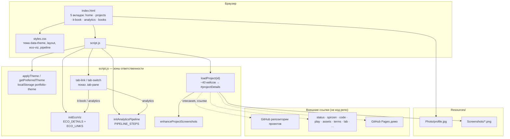

# Портфолио — Тагиров Тимур

Статическое портфолио: Fullstack-разработка, системный анализ, pet-проекты и экосистема **«Вселенная IT»** — [status.spirzen.ru](https://status.spirzen.ru/) · [spirzen.ru](https://spirzen.ru/) · [code](https://code.spirzen.ru/) · [play](https://play.spirzen.ru/) · [assets](https://assets.spirzen.ru/) и ещё 13 сервисов.

## Разделы

- **Главная** — стек, достижения, spotlight «Вселенная IT»
- **Проекты** — 40+ pet-проектов с описаниями и скриншотами
- **Вселенная IT** — многоуровневая платформа: 18 сервисов, 5 категорий, хаб status.spirzen.ru, порталы, MAUI
- **Аналитика** — BPMN, интеграции, low-code
- **Книги** — опубликованные и в работе

## Запуск

Откройте `index.html` в браузере или поднимите локальный сервер:

```bash
npx serve .
```

## Архитектура (L1)

Статический SPA без сборки: разметка в `index.html`, стили в `styles.css`, логика в `script.js`. Деплой — любой static host или GitHub Pages; бэкенда нет.



Редактируемая схема: [`docs/architecture/portfolio.drawio`](docs/architecture/portfolio.drawio) (draw.io / diagrams.net).

## Связанные репозитории

### Вселенная IT

| Роль | Репозиторий | Сайт |
|------|-------------|------|
| Хаб экосистемы | https://github.com/Spirzen/it-portals | https://status.spirzen.ru/ |
| Энциклопедия (хаб) | https://github.com/Spirzen/it-knowledge-base | https://spirzen.ru/ |
| Поиск | https://github.com/Spirzen/it-search | https://search.spirzen.ru/ |
| IT Code Examples | https://github.com/Spirzen/it-code-examples | https://code.spirzen.ru/ |
| IT Play | https://github.com/Spirzen/it-play | https://play.spirzen.ru/ |
| IT Encyclopedia Media | https://github.com/Spirzen/it-encyclopedia-media | https://assets.spirzen.ru/ |
| Глоссарий | https://github.com/Spirzen/it-terms | https://terms.spirzen.ru/ |
| Лаборатория | https://github.com/Spirzen/it-lab | https://lab.spirzen.ru/ |
| Инструменты | https://github.com/Spirzen/it-tools | https://tools.spirzen.ru/ |
| Игры | https://github.com/Spirzen/it-games | https://games.spirzen.ru/ |
| Для детей | https://github.com/Spirzen/it-kids | https://kids.spirzen.ru/ |
| Панель разработчика | https://github.com/Spirzen/it-management | localhost:8787 |
| Мобильное приложение | https://github.com/Spirzen/itu-mobile-app | APK на spirzen.ru |

Полный список 18 сервисов — на [status.spirzen.ru](https://status.spirzen.ru/) (`services.json`).

### Флагманские pet-проекты

| Проект | Репозиторий |
|--------|-------------|
| AllStarsMVP | https://github.com/Spirzen/AllStarsMVP |
| ArchiStyler | https://github.com/Spirzen/ArchiStyler |
| Dependency Graph Sentinel | https://github.com/Spirzen/Dependency-Graph-Sentinel |
| Database Schema Viewer | https://github.com/Spirzen/Database-Schema-Viewer |
| Code Example Validator | https://github.com/Spirzen/CodeExampleValidator |
| PATH Manager | https://github.com/Spirzen/PATHManager |
| Schema Maker | https://github.com/Spirzen/SchemaMaker |
| ArchiStyler Online | https://github.com/Spirzen/ArchiStylerOnline · [демо](https://spirzen.github.io/ArchiStylerOnline/) |
| Schema Maker Online | https://github.com/Spirzen/SchemaMakerOnline · [демо](https://spirzen.github.io/SchemaMakerOnline/) |
| SQL Generator Online | https://github.com/Spirzen/SQLGeneratorOnline · [демо](https://spirzen.github.io/SQLGeneratorOnline/) |

### Обновлённые и смежные

| Проект | Репозиторий |
|--------|-------------|
| Portfolio Browser | https://github.com/Spirzen/Browser |
| DocGenerator | https://github.com/Spirzen/DocGenerator |
| Excel2SQL | https://github.com/Spirzen/Excel2SQL |
| SQL Generator | https://github.com/Spirzen/SQL-Generator |
| QR Generator | https://github.com/Spirzen/QR-Generator |
| WordTrainer | https://github.com/Spirzen/WordTrainer |
| Indian Film Manager | https://github.com/Spirzen/Indian-Film-Manager |
| Центр поддержки (sample.support) | https://github.com/Spirzen/sample.support · [демо](http://sample.support/) |

### Игры

| Проект | Репозиторий |
|--------|-------------|
| Pythonablo | https://github.com/Spirzen/Pythonablo |
| Simple Survivors | https://github.com/Spirzen/Simple-Survivors |
| AutoBattler (Тени Шпиля) | https://github.com/Spirzen/AutoBattler |
| Приключения Урала Батыра | https://github.com/Spirzen/OnlineCardGame · [демо](https://spirzen.github.io/OnlineCardGame/) |

## Ресурсы

- `Resources/Photo/profile.jpg` — фото
- `Resources/Screenshots/` — скриншоты проектов
